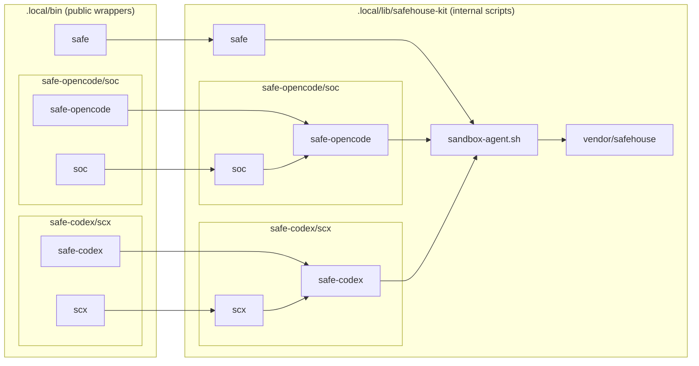

# safehouse-kit

`safehouse-kit` packages shell wrappers and sandbox policy assets for running
agent commands through a vendored Safehouse runtime.

## Included

- Public interface commands in `.local/bin/`:
  - `safe`, `safe-opencode`/`soc`, `safe-codex`/`scx`
- Internal runtime assets in `.local/lib/safehouse-kit/`:
  - command entrypoints, `sandbox-agent.sh`, `sandbox-agent.fish`
  - local policy profile `agents-local.sb`
- Vendored runtime script:
  - `.local/lib/safehouse-kit/vendor/safehouse`

## Dependency diagram

## Security posture

Agents are limited by the sandbox and run with all permissions inside it.

- `safe-codex` runs with `--yolo`.
- `safe-opencode` sets broad `OPENCODE_PERMISSION` grants.
- `agents-local.sb` includes local path and Dolt access grants (specific to my own setup).

## What to customize before use

- Remove or narrow broad permission flags and grants.
- Restrict filesystem path grants in `agents-local.sb` to minimum required
  paths.
- Review and tighten environment variable passthrough behavior.
- Validate policy behavior in your own runtime environment before use with
  sensitive repositories.
